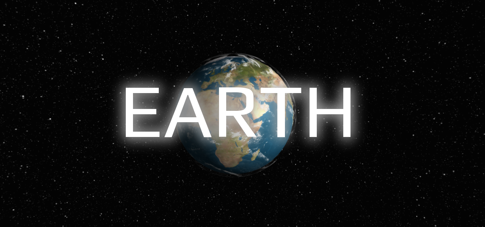

# ThreeEarth 🌍
[Preview](https://jangerlp.github.io/ThreeEarth/)

Spinning earth made with [Three.js](https://threejs.org/)

## Setting up local development environment 🖥️
For this to run you need to [install Node.js](https://nodejs.org/en/download/)

Then open the project and enter the following command in your terminal
```shell
npm install
```

That's it ✨

### Running the project in development mode
Enter the following command in the terminal
```shell
npm run dev
```

And then you're ready to explore 🚀
